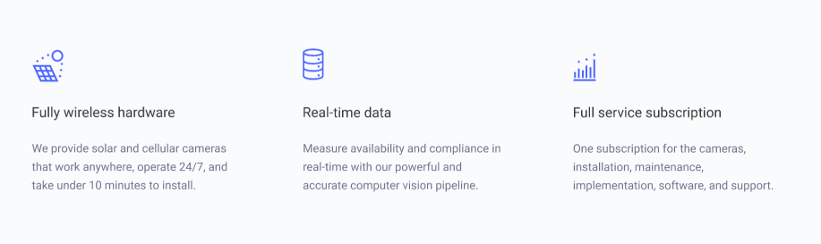

# veb_2sem

1)
блоки: #.human>#.head>#.body
элементы #.head>#.head__eye + #.head__nose
модификаторы #.body>#.body__arm-right.arm-right + #.body__arm-left.arm-left

2)

header.header>a.header__logo>img.header__img+a.header__link+nav.header__navigation>ul.header__navigation-list>(li.header__navigation-item>a.header__navigation-link)*4

ul.card>(li.card__list>img.card__img+p.card__text+p.card__content)*3

div.mail>p.mail__text+h3.mail__header+form.form>label.form__label>input.form__email+button.form__button

3)

div.card>img.card__img+div.info>h2.info__text+p.info__content+a.info__link

div.card-reserved>img.card__img-cut+div.info>h2.info__text+p.info__content+a.info__link

